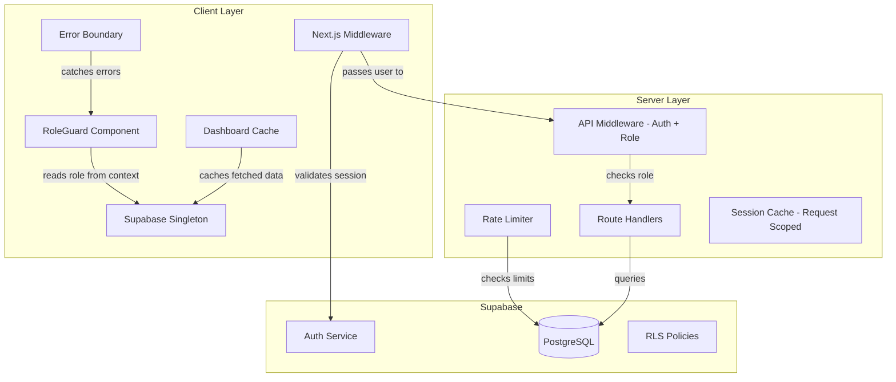
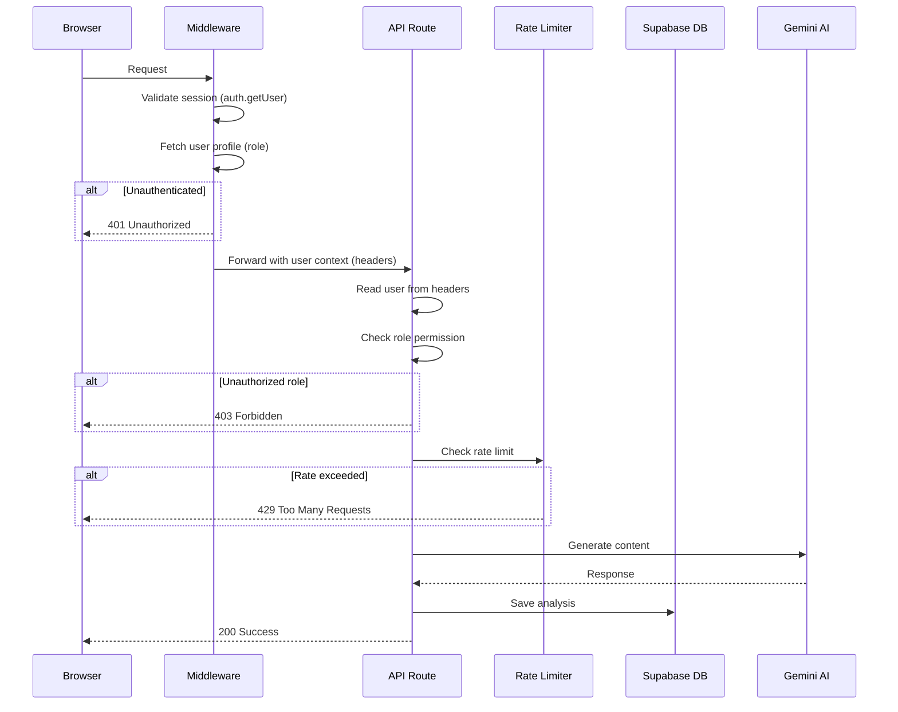

# Design Document: Performance and Role Optimization

## Overview

This design addresses 10 requirements for the Serenagri AI agricultural platform, focusing on three pillars: **role-based access control (RBAC)**, **performance optimization**, and **reliability/error handling**. The platform is a Next.js 16 application using Supabase (PostgreSQL + Auth) and Google Gemini AI, serving 6 user roles (farmer, buyer, supplier, logistics, finance, government).

### Current State Issues

1. **No RBAC enforcement** — All authenticated users can access all pages and API routes
2. **Memory leaks** — Multiple Supabase client instances created in components; no cleanup on unmount
3. **Missing database tables** — `transactions`, `matching_analyses`, `weather_analyses`, `rate_limits` referenced in code but not in schema
4. **No rate limiting** — AI endpoints have no request throttling
5. **Redundant auth checks** — Each API route independently calls `supabase.auth.getUser()`
6. **No error boundaries** — Runtime errors crash entire pages

### Design Goals

- Enforce role-based access at both page (client) and API (server) layers
- Eliminate memory leaks through singleton patterns and proper cleanup
- Complete the database schema with proper indexes and RLS policies
- Add rate limiting to protect AI endpoints from abuse
- Optimize data fetching with caching and parallel queries
- Add error boundaries for graceful degradation

## Architecture



### Request Flow



## Components and Interfaces

### 1. Role Permission Configuration (`src/lib/rbac.ts`)

Central configuration mapping roles to permitted pages and API routes.

```typescript
import { UserRole } from '@/types/auth';

export interface RolePermissions {
  pages: string[];       // Permitted dashboard page paths
  apiRoutes: string[];   // Permitted API route prefixes
  metricCards: string[]; // Metric cards to display on dashboard
  quickActions: string[]; // Quick action links
}

export const ROLE_PERMISSIONS: Record<UserRole, RolePermissions> = {
  farmer: {
    pages: ['/dashboard', '/dashboard/farmer', '/dashboard/chat', '/dashboard/weather', '/dashboard/matching'],
    apiRoutes: ['/api/ai/farmer', '/api/ai/chat', '/api/ai/matching', '/api/ai/weather', '/api/transactions'],
    metricCards: ['farmerAnalyses', 'chatConversations', 'weatherAnalyses'],
    quickActions: ['/dashboard/farmer', '/dashboard/weather', '/dashboard/chat', '/dashboard/transactions'],
  },
  buyer: {
    pages: ['/dashboard', '/dashboard/buyer', '/dashboard/chat', '/dashboard/matching', '/dashboard/transactions', '/dashboard/weather'],
    apiRoutes: ['/api/ai/buyer', '/api/ai/chat', '/api/ai/matching', '/api/ai/weather', '/api/transactions'],
    metricCards: ['buyerAnalyses', 'transactions', 'matchingAnalyses', 'chatConversations'],
    quickActions: ['/dashboard/buyer', '/dashboard/matching', '/dashboard/chat', '/dashboard/transactions'],
  },
  government: {
    pages: ['/dashboard', '/dashboard/farmer', '/dashboard/buyer', '/dashboard/policy', '/dashboard/chat', '/dashboard/matching', '/dashboard/weather', '/dashboard/transactions', '/dashboard/simulation'],
    apiRoutes: ['/api/ai/farmer', '/api/ai/buyer', '/api/ai/policy', '/api/ai/chat', '/api/ai/matching', '/api/ai/weather', '/api/transactions', '/api/admin/simulation'],
    metricCards: ['policyAnalyses', 'farmerAnalyses', 'buyerAnalyses', 'transactions'],
    quickActions: ['/dashboard/policy', '/dashboard/farmer', '/dashboard/buyer', '/dashboard/chat'],
  },
  supplier: {
    pages: ['/dashboard', '/dashboard/matching', '/dashboard/transactions', '/dashboard/chat', '/dashboard/weather'],
    apiRoutes: ['/api/ai/chat', '/api/ai/matching', '/api/ai/weather', '/api/transactions'],
    metricCards: ['chatConversations', 'farmerAnalyses'],
    quickActions: ['/dashboard/farmer', '/dashboard/chat', '/dashboard/transactions'],
  },
  logistics: {
    pages: ['/dashboard', '/dashboard/matching', '/dashboard/transactions', '/dashboard/chat', '/dashboard/weather'],
    apiRoutes: ['/api/ai/chat', '/api/ai/matching', '/api/ai/weather', '/api/transactions'],
    metricCards: ['chatConversations', 'farmerAnalyses'],
    quickActions: ['/dashboard/chat', '/dashboard/transactions'],
  },
  finance: {
    pages: ['/dashboard', '/dashboard/policy', '/dashboard/transactions', '/dashboard/chat', '/dashboard/weather'],
    apiRoutes: ['/api/ai/policy', '/api/ai/chat', '/api/ai/matching', '/api/ai/weather', '/api/transactions'],
    metricCards: ['chatConversations', 'farmerAnalyses'],
    quickActions: ['/dashboard/buyer', '/dashboard/chat', '/dashboard/transactions'],
  },
};

// Fallback for unknown/missing roles
export const DEFAULT_PERMISSIONS: RolePermissions = {
  pages: ['/dashboard'],
  apiRoutes: ['/api/ai/chat', '/api/ai/weather'],
  metricCards: ['chatConversations'],
  quickActions: ['/dashboard/chat', '/dashboard/weather'],
};

export function getPermissions(role: UserRole | null | undefined): RolePermissions {
  if (!role || !(role in ROLE_PERMISSIONS)) return DEFAULT_PERMISSIONS;
  return ROLE_PERMISSIONS[role];
}

export function isPagePermitted(role: UserRole | null | undefined, pathname: string): boolean {
  const perms = getPermissions(role);
  return perms.pages.some(p => pathname === p || pathname.startsWith(p + '/'));
}

export function isApiRoutePermitted(role: UserRole | null | undefined, pathname: string): boolean {
  const perms = getPermissions(role);
  return perms.apiRoutes.some(prefix => pathname.startsWith(prefix));
}
```

### 2. Enhanced Middleware (`src/middleware.ts`)

Handles auth validation, role-based page access, and passes session data to API routes via headers.

```typescript
export async function middleware(request: NextRequest) {
  // 1. Create Supabase server client with cookie handling
  // 2. Validate user session (auth.getUser)
  // 3. For dashboard pages: check role permission, redirect to /dashboard if unauthorized
  // 4. For API routes: attach user ID and role as request headers (x-user-id, x-user-role)
  // 5. Return 401 for unauthenticated API requests
}
```

### 3. Rate Limiter (`src/lib/rate-limiter.ts`)

Server-side rate limiting using the `rate_limits` Supabase table.

```typescript
export interface RateLimitConfig {
  maxRequests: number;
  windowMs: number; // 15 minutes = 900000
}

export const RATE_LIMITS: Record<string, RateLimitConfig> = {
  ai_analysis: { maxRequests: 10, windowMs: 900000 },
  chat: { maxRequests: 30, windowMs: 900000 },
};

export interface RateLimitResult {
  allowed: boolean;
  remaining: number;
  retryAfterSeconds?: number;
}

export async function checkRateLimit(
  userId: string,
  endpoint: string,
  config: RateLimitConfig
): Promise<RateLimitResult>;

export async function decrementRateLimit(
  userId: string,
  endpoint: string
): Promise<void>;
```

### 4. API Route Helper (`src/lib/api-helpers.ts`)

Utility to extract cached session from middleware headers and enforce role checks.

```typescript
export interface RequestContext {
  userId: string;
  userRole: UserRole;
}

export function getRequestContext(request: Request): RequestContext | null;

export function createForbiddenResponse(message?: string): NextResponse;
export function createUnauthorizedResponse(message?: string): NextResponse;
export function createRateLimitResponse(retryAfter: number): NextResponse;
```

### 5. RoleGuard Component (`src/components/auth/RoleGuard.tsx`)

Client-side component that filters navigation items and redirects unauthorized page access.

```typescript
interface RoleGuardProps {
  children: React.ReactNode;
}

export function RoleGuard({ children }: RoleGuardProps): JSX.Element;
// - Reads role from RoleContext
// - Checks current pathname against permitted pages
// - Redirects to /dashboard if unauthorized
// - Renders children only if authorized
```

### 6. Supabase Client Singleton (`src/lib/supabase/client.ts`)

Module-level singleton to prevent multiple client instances.

```typescript
let browserClient: SupabaseBrowserClient | null = null;

export function createClient(): SupabaseBrowserClient {
  if (browserClient) return browserClient;
  browserClient = createBrowserClient(url, key);
  return browserClient;
}
```

### 7. Dashboard Data Cache (`src/lib/dashboard-cache.ts`)

In-memory cache for dashboard data with TTL-based invalidation.

```typescript
interface CacheEntry<T> {
  data: T;
  timestamp: number;
}

export class DashboardCache {
  private cache: Map<string, CacheEntry<unknown>>;
  private ttl: number; // 60 seconds

  get<T>(key: string): T | null;
  set<T>(key: string, data: T): void;
  invalidate(key: string): void;
  clear(): void;
}
```

### 8. Error Boundary Component (`src/components/error/ErrorBoundary.tsx`)

React error boundary with localized error messages and retry capability.

```typescript
interface ErrorBoundaryProps {
  children: React.ReactNode;
  fallback?: React.ReactNode;
}

interface ErrorBoundaryState {
  hasError: boolean;
  error: Error | null;
}

export class ErrorBoundary extends React.Component<ErrorBoundaryProps, ErrorBoundaryState>;
```

### 9. Connection Monitor (`src/components/error/ConnectionBanner.tsx`)

Monitors Supabase connectivity and displays a banner when disconnected.

```typescript
export function ConnectionBanner(): JSX.Element | null;
// - Pings Supabase every 30 seconds when disconnected
// - Max 5 retry attempts
// - Auto-dismisses on reconnection
```

## Data Models

### New Tables

#### `transactions`
| Column | Type | Constraints |
|--------|------|-------------|
| id | uuid | PK, default gen_random_uuid() |
| buyer_id | uuid | FK profiles(id) ON DELETE CASCADE, NOT NULL |
| farmer_id | uuid | FK profiles(id) ON DELETE SET NULL, NULLABLE |
| commodity | text | NOT NULL |
| volume | numeric | NOT NULL |
| volume_unit | text | NOT NULL |
| price_per_unit | numeric | NULLABLE |
| total_value | numeric | NULLABLE |
| delivery_province | text | NOT NULL |
| delivery_city | text | NULLABLE |
| start_date | date | NULLABLE |
| end_date | date | NULLABLE |
| status | text | NOT NULL, DEFAULT 'draft', CHECK IN ('draft','proposed','accepted','in_progress','completed','cancelled') |
| terms | jsonb | NULLABLE |
| created_at | timestamptz | NOT NULL, DEFAULT now() |
| updated_at | timestamptz | NOT NULL, DEFAULT now() |

**Indexes:** `(buyer_id, created_at DESC)`, `(farmer_id, created_at DESC)`
**Trigger:** `update_updated_at` on UPDATE

#### `matching_analyses`
| Column | Type | Constraints |
|--------|------|-------------|
| id | uuid | PK, default gen_random_uuid() |
| user_id | uuid | FK profiles(id) ON DELETE CASCADE, NOT NULL |
| input | jsonb | NOT NULL |
| result | jsonb | NULLABLE |
| created_at | timestamptz | NOT NULL, DEFAULT now() |

**Index:** `(user_id, created_at DESC)`

#### `weather_analyses`
| Column | Type | Constraints |
|--------|------|-------------|
| id | uuid | PK, default gen_random_uuid() |
| user_id | uuid | FK profiles(id) ON DELETE CASCADE, NOT NULL |
| input | jsonb | NOT NULL |
| result | jsonb | NULLABLE |
| created_at | timestamptz | NOT NULL, DEFAULT now() |

**Index:** `(user_id, created_at DESC)`

#### `rate_limits`
| Column | Type | Constraints |
|--------|------|-------------|
| id | uuid | PK, default gen_random_uuid() |
| user_id | uuid | FK profiles(id) ON DELETE CASCADE, NOT NULL |
| endpoint | text | NOT NULL |
| request_count | integer | NOT NULL, DEFAULT 0 |
| window_start | timestamptz | NOT NULL |
| created_at | timestamptz | NOT NULL, DEFAULT now() |

**Index:** `(user_id, endpoint, window_start)`

### RLS Policies

| Table | Operation | Policy |
|-------|-----------|--------|
| transactions | SELECT | `auth.uid() = buyer_id OR auth.uid() = farmer_id` |
| transactions | INSERT | `auth.uid() = buyer_id` |
| transactions | UPDATE | `auth.uid() = buyer_id OR auth.uid() = farmer_id` |
| matching_analyses | SELECT | `auth.uid() = user_id` |
| matching_analyses | INSERT | `auth.uid() = user_id` (check) |
| weather_analyses | SELECT | `auth.uid() = user_id` |
| weather_analyses | INSERT | `auth.uid() = user_id` (check) |
| rate_limits | ALL | No access for authenticated users; service_role only |

## Correctness Properties

*A property is a characteristic or behavior that should hold true across all valid executions of a system — essentially, a formal statement about what the system should do. Properties serve as the bridge between human-readable specifications and machine-verifiable correctness guarantees.*

### Property 1: Role-permission mapping completeness

*For any* valid UserRole, the `getPermissions` function SHALL return a RolePermissions object where the `pages` array contains exactly the set of dashboard paths specified in the requirements for that role, the `apiRoutes` array contains exactly the permitted API route prefixes, and the `metricCards` array contains exactly the configured metrics.

**Validates: Requirements 1.1, 1.2, 1.3, 1.4, 1.5, 1.6, 2.7, 8.1, 8.2, 8.3, 8.4**

### Property 2: Unauthorized access denial

*For any* valid UserRole and *for any* page path or API route path that is NOT contained in that role's permitted set, the `isPagePermitted` and `isApiRoutePermitted` functions SHALL return `false`.

**Validates: Requirements 1.7, 2.1, 2.2, 2.3, 2.4**

### Property 3: Fallback permissions for invalid roles

*For any* string value that is not a valid UserRole (including null, undefined, and arbitrary strings), the `getPermissions` function SHALL return the DEFAULT_PERMISSIONS object containing only Chat and Weather pages.

**Validates: Requirements 1.9, 2.8**

### Property 4: Rate limit enforcement

*For any* authenticated user and *for any* sequence of N requests to a rate-limited endpoint within a 15-minute window where N exceeds the configured maximum (10 for AI analysis, 30 for chat), the rate limiter SHALL reject the (max+1)th request and all subsequent requests within that window.

**Validates: Requirements 3.1, 3.2, 3.3**

### Property 5: Rate limit Retry-After accuracy

*For any* rate-limited request that is rejected, the `Retry-After` header value SHALL equal the number of seconds remaining until the oldest request in the current window expires (i.e., `windowStart + 900 seconds - currentTime`).

**Validates: Requirements 3.3**

### Property 6: Rate limit decrement on server error

*For any* sequence of requests where some result in 5xx errors from the AI service, the effective request count in the rate limit window SHALL equal the total number of requests minus the number of 5xx responses.

**Validates: Requirements 3.5**

### Property 7: Supabase client singleton identity

*For any* number of calls to `createClient()` within the same browser context, all calls SHALL return the same object reference (referential equality).

**Validates: Requirements 4.1**

### Property 8: Dashboard cache behavior

*For any* cached dashboard data entry, if the cache is queried within 60 seconds of the entry being stored, the cache SHALL return the stored data. If a background refresh fails, the cache SHALL continue to return the previously stored data unchanged.

**Validates: Requirements 7.2, 7.5**

### Property 9: Quick actions subset invariant

*For any* valid UserRole, every path in the role's `quickActions` array SHALL be contained within that role's `pages` array (quick actions are always a subset of permitted pages).

**Validates: Requirements 8.5**

### Property 10: Activity items filtering and ordering

*For any* valid UserRole and *for any* set of activity items from the database, the filtered activity list SHALL contain at most 5 items, all items SHALL originate from features the role has access to, and items SHALL be sorted by `created_at` in descending order.

**Validates: Requirements 8.6**

### Property 11: Pagination limit enforcement

*For any* list query with `page` and `pageSize` parameters, the number of returned rows SHALL never exceed `min(pageSize, 50)`, and the response SHALL include a `total` count field.

**Validates: Requirements 9.2**

### Property 12: Error response integrity on query failure

*For any* database query that throws an error or times out, the API response SHALL have `success: false` and contain an `error` field. The response SHALL NOT return an empty result set with `success: true`.

**Validates: Requirements 9.7**

### Property 13: Error sanitization in client responses

*For any* error originating from the Gemini AI service or any unhandled exception in production mode, the client-facing response SHALL contain only a generic localized error message and SHALL NOT contain stack traces, file paths, internal service identifiers, or environment variable values.

**Validates: Requirements 10.5, 10.6**

## Error Handling

### Client-Side Error Handling

| Scenario | Handling Strategy |
|----------|-------------------|
| Dashboard data fetch failure | Display inline error with retry button; show metrics as 0 |
| AI analysis API failure | Show localized error notification within the requesting component |
| Supabase connection lost | Display persistent banner; retry every 30s up to 5 times |
| Supabase connection restored | Auto-dismiss banner within 5 seconds |
| Max retries exhausted | Show persistent banner with manual reload instruction |
| Component runtime error | Catch in ErrorBoundary; show localized error + reload button |
| Unauthorized page access | Redirect to /dashboard immediately |

### Server-Side Error Handling

| Scenario | Response |
|----------|----------|
| Unauthenticated request | 401 `{ error: "Authentication required" }` |
| Unauthorized role | 403 `{ error: "Insufficient permissions" }` |
| Rate limit exceeded | 429 `{ error: "Rate limit exceeded" }` + `Retry-After` header |
| Gemini AI error | 500 `{ success: false, error: "Gagal menghasilkan analisis" }` (localized) |
| Database query timeout (>10s) | 500 `{ success: false, error: "Gagal memuat data" }` |
| Database query error | 500 `{ success: false, error: "Gagal memuat data" }` |
| Middleware auth timeout (>5s) | 401 response, route handler not executed |

### Error Sanitization Rules (Production)

1. Never expose stack traces to client
2. Never expose file paths or line numbers
3. Never expose internal service names (e.g., "Gemini", "Supabase")
4. Never expose environment variables
5. Log full error details server-side with `console.error`
6. Return generic Indonesian-language error messages to client

## Testing Strategy

### Unit Tests (Example-Based)

| Area | Tests |
|------|-------|
| RBAC configuration | Verify each role's exact page/route/metric mapping against requirements |
| Middleware auth flow | Test 401 for missing token, expired token, timeout |
| Rate limiter edge cases | Unauthenticated bypass, window expiry boundary |
| Component cleanup | AbortController cancellation on unmount, stream reader cancel |
| Error boundary | Catches child errors, renders fallback UI |
| Connection banner | Retry logic, max attempts, auto-dismiss |
| Skeleton loading | Renders placeholders before data arrives |

### Property-Based Tests

**Library:** [fast-check](https://github.com/dubzzz/fast-check) (TypeScript PBT library)

**Configuration:** Minimum 100 iterations per property test.

| Property | Generator Strategy |
|----------|-------------------|
| Property 1: Role-permission mapping | Generate random valid UserRole values; verify mapping matches spec |
| Property 2: Unauthorized access denial | Generate (role, path) pairs where path ∉ role's permitted set |
| Property 3: Fallback permissions | Generate arbitrary strings not in UserRole union type |
| Property 4: Rate limit enforcement | Generate request sequences with varying counts and timestamps |
| Property 5: Retry-After accuracy | Generate window_start timestamps and current times; verify calculation |
| Property 6: Decrement on server error | Generate request sequences with random 5xx/2xx outcomes |
| Property 7: Singleton identity | Call createClient() N times (N ∈ [1, 100]); verify same reference |
| Property 8: Cache behavior | Generate cache entries with varying timestamps; verify TTL logic |
| Property 9: Quick actions subset | Generate all roles; verify quickActions ⊆ pages |
| Property 10: Activity filtering | Generate activity item arrays with random features/dates; verify filtering |
| Property 11: Pagination limit | Generate random page/pageSize values; verify result ≤ min(pageSize, 50) |
| Property 12: Error response integrity | Generate various error types; verify response format |
| Property 13: Error sanitization | Generate error messages containing stack traces, paths, etc.; verify sanitized output |

**Tag format:** `Feature: performance-and-role-optimization, Property {N}: {title}`

### Integration Tests

| Area | Tests |
|------|-------|
| Database schema | Verify all tables, columns, constraints, indexes, and RLS policies exist |
| Middleware → Route handler | Verify user context passes correctly via headers |
| Rate limiter + Supabase | Verify rate_limits table records are created and queried correctly |
| Full auth flow | Login → access permitted page → access denied page → verify redirect |
| Query performance | Verify list queries use indexes (EXPLAIN ANALYZE) |

### Smoke Tests

| Area | Tests |
|------|-------|
| Migration script | Run migration, verify tables exist |
| RLS policies | Verify service_role-only access on rate_limits table |
| Singleton pattern | Verify no createClient() calls inside useEffect in codebase |
| Session cache performance | Verify header parsing < 1ms |

